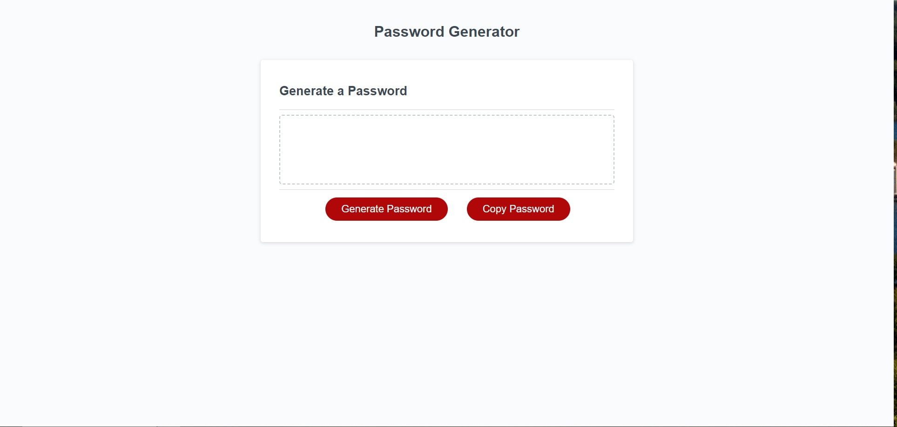

# Random Password Generation with Prompts

## Description
This project uses javascript, html, and css to create a webpage that you can use to randomly generate a password based on user input.

## Installation

N/A

## Usage
Open https://larwis95.github.io/password-gen-with-reqs/ in your browser. Click the generate password button, read and follow the prompts to set criteria for your password. Press the copy button to copy the password to your clipboard.

## Screenshot

## Credits
Maximilian Lindsey: https://stackoverflow.com/a/34025991
-Shuffle string function lines 92-102 of assets/js/scripts.js

## License

N/A